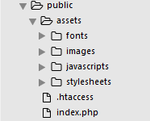
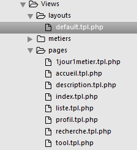
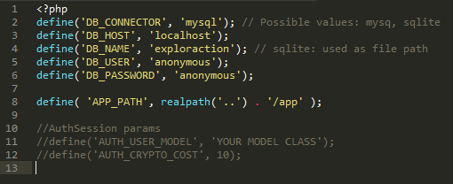
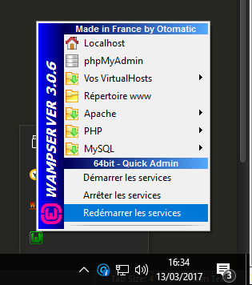
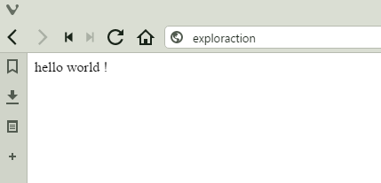

# ExplorAction

##
## Sommaire

### 1. [Guide  Utilisateurs](#1)
#### 	1.1 [Installation en local](#11)
#### 	1.2 [Et les modifications alors ?](#12)
### 2. [Outils](#2)
#### 	2.1 [Pragma-framework](#21)
#####		2.1.1 [Installation](#211)
#####		2.1.2 [Utilisation](#212)
#### 	2.2 [Phinx](#22)
#### 	2.3 [autocomplete.js](#23)
#### 	2.4 [parallax.js](#24)
#### 	2.5 [Pure.css](#25)

## Guide Utilisateurs <a name=1></a>

### Installation en local <a name=11></a>

Je vous invite à vous rendre dans la partie sur pragma avant de télécharger le dépôt, celle-ci est très bien détaillée et indispensable pour la suite ! 

En particulier pour cloner, le dépôt il vous faudra les pré-requis suivant : 

  * Un serveur AMP
  * Composer
  
Une fois le dépôt cloné, il vous faut installer les dépendances du projet. Depuis un terminal/invite de commande tape la ligne suivant à la racine du projet:

```
php composer.phar update
```
 
Puis configurer le virtualhost si vous avez suivi le tuto "Hello World !" de la partie de pragma-framework vous n'avez qu'à changer les deux lignes concernant le DocumentRoot

Sous linux : ```/var/www/framework/public``` par ```/var/www/ExplorAction/public```

Sous windows : ```C:\wamp64\www\framework\public``` par ```C:\wamp64\www\ExplorAction\public```

Et si vous n'aviez pas fait cette étape ... [Qu'attendez-vous ?](#hello)


Allez sur votre naviguateur internet préféré et tapez exploraction/ dans la bar d'adresse.

**Wooh !**


### Et les modifications alors ? <a name=12></a>

Patience jeune Padawan ! Comme tu as de la chance, le travail t'est maché.

#### Design et animation

Le plus gros du travail se trouve ici, dans le répertoire public, ce n'est d'ailleurs pas pour rien qu'on l'a mis en DocumentRoot 


Les fichiers de style (.css) se trouvent dans public/assets/stylesheets.
Les fichiers d'animation (.js) se trouvent dans public/assets/javascripts.
Les images se trouvent dans ... vous avez compris le truc. 

Et dans un premier temps c'est tout ce que vous avez à savoir. Pour la suite je vous invite à lire la [Partie MVC](#mvc) de Pragma-framework juste un peu plus bas.

...

C'est bon vous êtes au point ? 

Ok, c'est parti ! 

Sachez que nous avons opté pour le "one single interface" et gardé le modèle MVC, c'est assez difficile à gérer puisqu'ils utilisent deux technologies fondamentalement différente  l'une exploite la puissante du serveur grâce à php et l'autre la rapidité de vos machines grâce à jQuery. 

Pour tout ce qui est visuel, les modifications html se font depuis le dossier View situé dans app/ 



Les deux fichiers importants sont les ```default.tpl.php``` et ```index.tpl.php```

  * Le premier donne les métas informations nécessaire à la formation de la page. C'est ici que vous lierez vos fichiers ```.css``` et ```.js``` 

  * Le second correspond à la structure de bases dans le contenu.
 
Il est important que vous compreniez le fonctionnement de cette architecture. 

*__Cas pratique:__*

Lorsque je veux modifier un style du profil utilisateur par exemple.
 
Il me faut:

1. Apporter les modifications esthétiques dans les feuilles de style appropriées dans le dossier ```public/assets/stylesheets```
2. Ajouter le lien (s'il n'existe pas déjà) par la balise ```<link>``` dans le fichier ```default.tpl.php``` du dossier ```app/Views/layouts/```
3. Ajouter les classes sur les éléments html le demandant sur la page ```profil.tpl.php``` du dossier ```app/Views/pages```      

## Outils <a name=2></a>

### Pragma-Framework <a name=21></a>

Nous utilisons le framework php Pragma de Cyril Rouyer. Ce framework n'a pas de documentation exhaustive. Nous nous sommes donc permis de documenter les parties qui nous intéressaient 

Cette installation n'est utile que pour tester les fonctionnalités du projet. Le framework est déjà incorporé au projet.

#### Installation <a name=211></a>

##### Windows

1. Assurer-vous d'avoir installé les pré-requis:
  * [WampServer](http://www.wampserver.com/en/ "WampServer's Homepage")
  * [Github](https://desktop.github.com "Github desktop app")
  * [Composer](https://getcomposer.org/download/ "Download composer-setup.exe")
2. Cloner le github du framework Pragma : 
  * Utiliser Git Shell pour vous déplacer dans l'arborescence de fichiers avec la commande : "cd C:\wamp64\www\"
  * Copier le dépôt du projet : "git clone https://github.com/pragma-framework/framework.git"
3. Depuis l'explorateur de fichiers Windows déplacer vous dans le dossier du dépôt et ouvrer une invite de commande : 
  * CTRL+MAJ+clique droit
  * Cliquer sur "Ouvrir une fenêtre de commande ici"
4. Installer votre framework :
  * (Vous pouvez vérifier l'installation de votre composer depuis l'invite de commande grâce à la commande "composer -v")
  * Depuis la fenêtre de commande dans le dossier framework taper la commande "composer install"
  * Vérifier dans l'explorateur de fichiers que le dossier vendor a été créé. 
5. Configurer l'accès à la base de données : 
  * Copier et renommer le fichier config.default.php du dossier config en config.php
  * Remplacer les variables "db-" par vos propres variables de connexions
  
6. Enjoy ! 

##### Linux

1. Assurer-vous d'avoir installé les pré-requis: 
  * [serveur lamp](https://doc.ubuntu-fr.org/lamp "tuto d'installation lamp")
  * [git](https://git-scm.com/download/linux "tuto d'installation git")
  * make "sudo apt-get install build-essential"
2. Cloner le github du framework Pragma : 
  * Depuis un terminal placer vous dans le dossier www "cd /var/www"
  * Copier le dépôt du projet : "git clone https://github.com/pragma-framework/framework.git"
3. Installer votre framework :
  * Entrer dans le dossier framework "cd framework"
  * Taper la commande "php composer.phar install"
  * (Si erreur copier les lignes suivantes dans le terminale :
  > php -r "copy('https://getcomposer.org/installer', 'composer-setup.php');"

  > php -r "if (hash_file('SHA384', 'composer-setup.php') === '669656bab3166a7aff8a7506b8cb2d1c292f042046c5a994c43155c0be6190fa0355160742ab2e1c88d40d5be660b410') { echo 'Installer verified'; } else { echo 'Installer corrupt'; unlink('composer-setup.php'); } echo PHP_EOL;"

  > php composer-setup.php
  * puis retaper la commande "php composer.phar install" et taper la commande 
  >php -r "unlink('composer-setup.php');"
  
  )
  * Vérifier dans l'explorateur de fichiers que le dossier vendor a été créé."
4. Configurer l'accès à la base de données : 
  * Copier et renommer le fichier config.default.php du dossier config en config.php
  * Remplacer les variables "db-" par vos propres variables de connexions
  
  * Toujours depuis le terminal dans le dossier framework taper "make config/config.php"
  * Enfin taper "$VISUAL config/config.php"

5. Enjoy ! 

#### Utilisation <a name=212></a>

##### Hello World ! <a name=hello></a>

Il ne faut pas sous-estimer l'importance de cette étape : l'implémentation d'un "Hello World !" est on-ne-peut-plus symbolique en information et est le gage d'une première réutilise. C'est partie.
Pragma-Framework comme son nom l'indique ... est pragmatique il va à l'essential. Si l'url lui indique cela, il fera cela. Point. Mais il faut que l'url lui indique quelque chose de précis pour qu'il le comprenne.
Comme pour la gestion de projet, la phase de préparation est importante et doit être rigureusement appliquée.
Le but de cette manipulation est faire croire à notre navigateur que le projet est un vrai site internet. Pour illustrer ce que nous allons faire, prenons l'exemple de google.fr. Lorsque tu tapes google.fr le navigateur le traduit en 216.58.198.195 mais pour nous humain la lecture est plus agréable si on traite une information lisible.
Pragma utilise le même niveau de lecture que l'utilisateur et c'est logique. Un framework est là pour simplifier la vie des développeurs. Ils sont généralement de plus haut niveau que les langages sur lesquels ils sont basés. Ainsi un framework ne fera pas plus mais plus simplement. Bon fini le blabla passons au manipulation

Sauf exception la racine des chemins sera toujours framework.

###### Windows 

1. Préparation du Hello World !
  * Ecrire 'echo "Hello World !";' dans la section DO SOMETHING HERE du fichier index.php se trouvant dans /framework/public
    * (Vous pouvez le tester dans votre navigateur avec l'adresse localhost/framework/public ... bien sûr ça ne fonctionnera pas ce serait trop simple.)
2. Création d'un VirtualHost
  * Pour éviter polluer les fichiers de base de wamp vous allez créer un nouveau fichier exploraction.conf dans le dossier C:\wamp64\bin\apache\apache2.X.XX\conf\extra
  * Ecrire le contenu suivant dans le fichier créé :
  ```  
	<VirtualHost *:80>
        ServerName exploraction
        DocumentRoot C:\wamp64\www\framework\public
        CustomLog  C:\wamp64\logs\exploraction_access.log combined
        ErrorLog  C:\wamp64\logs\exploraction_error.log
		<Directory C:\wamp64\www\framework\public>
          Options Indexes FollowSymLinks
          AllowOverride None
          Require all granted
        </Directory>
    </VirtualHost>
  ```  
  
3. Autorisation de VirtualHost
  * Ajouter la ligne "Include conf/extra/exploraction.conf" dans la section VirtualHost du fichier httpd.conf du dossier C:\wamp64\bin\apache\apache2.X.XX\conf\
  * Vérifier que la ligne "LoadModule vhost_alias_module modules/mod_vhost_alias.so" de ce même fichier soit décommentée.
4. Modifier les hosts
  * Ajouter à la fin du fichier hosts du dossier C:\Windows\System32\drivers\etc la ligne "127.0.0.1 exploraction"
5. Redémarrer les services wamp

  
6. Taper dans votre navigateur exploraction/ 

   
7. Enjoy

###### Linux 

1. Préparation du Hello World !
  * Ecrire 'echo "Hello World !";' dans la section DO SOMETHING HERE du fichier index.php se trouvant dans /framework/public
    * (Vous pouvez le tester dans votre navigateur avec l'adresse localhost/framework/public ... bien sûr ça ne fonctionnera pas ce serait trop simple.)
2. Création d'un VirtualHost
  * Pour éviter polluer les fichiers de base de apache vous allez créer un nouveau fichier exploraction.conf dans le dossier /etc/apache2/sites-availabled
  * Ecrire le contenu suivant dans le fichier créé :
  ```
  <VirtualHost *:80>
    ServerName exploraction
    DocumentRoot /var/www/framework/public
    CustomLog  /var/log/apache2/exploraction_access.log combined
    ErrorLog  /var/log/apache2/exploraction_error.log
    <Directory /var/www/framework/public>
      Options Indexes FollowSymLinks
      AllowOverride None
      Require all granted
    </Directory>
  </VirtualHost>
  ```  
3. Autorisation de VirtualHost
  * Taper la commande a2ensite exploraction.conf dans votre terminale
  * Vérifier que le module rewrite soit activé avec la commande a2enmod rewrite
4. Modifier les hosts
  * Ajouter à la fin du fichier hosts du dossier /etc/hosts la ligne "127.0.0.1 exploraction"
5. Redémarrer le service apache
6. Taper dans votre navigateur exploraction/ 	
  
7. Enjoy


  

##### MVC Pattern <a name=mvc></a>
  
[](http://www.youtube.com/watch?v=4Qfk8MhtZJU)

Maintenant que tu sais ce qu'est le modèle MVC, on peut passer aux choses sérieuses. A partir d'ici il n'y a plus de distinction entre linux et windows est c'est bien là l'intérer du MVC et c'est aussi du au fait que passe vraiment à la programmation.

Dans le dossier framework/app on a trois dossiers :
  * Controllers
  * Models
  * Views 
Il nous faudra un fichier dans Models par table de notre BDD, un fichier dans Views par affichage différent et un fichier dans Controllers par fonctionnalité.

Dans ce premier exemple nous allons utiliser ce modèle pour afficher le contenu de la table metier.
Avant d'utiliser cette exemple n'oubliez pas d'importer le fichier sql fourni dans le dépôt à votre phpmyadmin. 

1. Views

  * Dessiner l'affichage global des pages dans un fichier que vous nommerez default.tpl.php et il sera à placer dans le dossier layouts de framework/app/Views
  
	```html
	<!DOCTYPE html>
	<html>
		<head>
			<title>Exploraction</title>
			<meta http-equiv="Content-Type" content="text/html; charset=UTF-8" />	
		</head>
		<body>
			<h1>Explor'action</h1>
			<?php $this->yields('default');?>
		</body>
	</html>
	```

  * Dessiner l'affichage spécifique du contenu des médias dans un fichier que vous nommerez index.tpl.php et il sera à placer dans un dossier metiers dans framework/app/Views
  
	```php
	<?php
	$metiers = $this->get('metiers');
	var_dump($metiers);
	?>
	<h2> Liste des métiers </h2>
	```

2. Models
  * Créer la classe Metier correspondant à la table metier de la base de données. Pour ce faire, écriver le code suivant dans un fichier Metier.php à placer dans le dossier framework/app/Models
	```php
	<?php
	namespace App\Models;

	use Pragma\ORM\Model;

	class Metier extends Model{
		const TABLENAME = 'metier';

		public function __construct(){
			return parent::__construct(self::TABLENAME);
		}
	}
	?>
	```  

3. Controllers 
  * Dernière étape "que faire avec quoi" écrire le code suivant dans un fichier MetiersController.php du dossier framework/app/Controllers

	```php

	<?php
	namespace App\Controllers;

	use Pragma\Controller\BaseController;
	use App\Models\Metier;

	class MetiersController extends BaseController{
		public function index(){
			$this->view->assign('metiers',Metier::all());
			$this->view->render('metiers/index.tpl.php');
		}
	}
	?>

	```

4. De retour dans le fichier index.php du dossier framework/public, décommenter les 4 lignes $view
5. Ajouter le bout de code suivant après la section $app->get :
	```php
	$app->group('/metiers',function() use ($app){
		$app->get('',function(){
			(new App\Controllers\MetiersController())->index();
		});

	});
	``` 
6. Alors ça marche ?!


### Phinx <a name=22></a>

Cet outil développé par Rob Morgan permet d'effectuer des modifications sur la structure de la base de données. En attendant, un tutoriel et des outils adaptés à notre sites, je vous renvois vers la documentation officielle : [doc phinx](https://doc.phinx.org/ "doc officiel de phinx")

### autocomplete.js <a name=23></a>

Ce widget jQuery est utilisé dans notre système de recherche. Il sert à simplifier la recherche de nos utilisateurs dans la base de données. Pour plus d'information sur son utilisation veuillez consulter la documentation suivante : [api jqueryui](http://api.jqueryui.com/autocomplete/ "autocomplete doc officiel ")

### parallax.js <a name=24></a>

Cet outil nous permet une gestion des pages en version "one single interface" : [parallax.js](https://github.com/wagerfield/parallax "ReadMe de github")

### Pure.css <a name=25></a>

Il s'agit d'un framework css qui assura la partie design de notre site : [Pure.css](https://purecss.io "Site de pure css")
